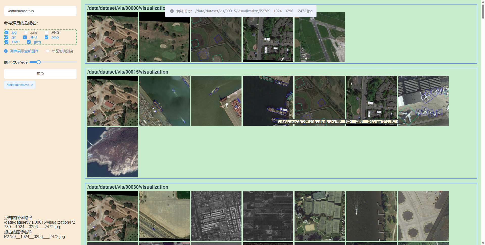

# vue2-image-viewer

Simple and fast web-based image viewing tool based on vue2 and flask, which can be deployed locally or on remote servers.

Especially helpful for deep learning & computer vision practitioners to view images.

Any PR or issue will be appreciated!

<div align="center">
  
</div>

## Quick Use

Install dependencies:
```
pip install flask
pip install Flask-Cors
```

Then just run
```
python backend/file_server.py
```
and view your images on `http://127.0.0.1:8003`


## Project setup
```
npm install
```

### Compiles and hot-reloads for development
```
python backend/file_server.py
npm run serve
```

### Compiles and minifies for production
```
npm run build
```
or
```
python utils/build_vue.py
```

### Lints and fixes files
```
npm run lint
```

### Customize configuration
See [Configuration Reference](https://cli.vuejs.org/config/).


