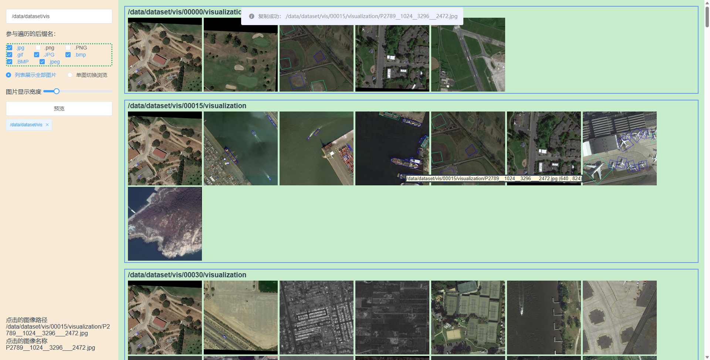

# vue2-image-viewer

基于vue2和flask的简单快速网络图像查看工具，可在本地或远程服务器上部署。

特别适用于深度学习和计算机视觉从业者看图。

欢迎提出PR或issue！

<div align="center">
  
</div>

## 立即使用

只要有python就能使，用不着npm也用不着node啥的，干就完了

安装依赖：
```
pip install flask
pip install Flask-Cors
```

然后运行以下命令即可：
```
python backend/file_server.py
```
在 `http://127.0.0.1:8003` 上查看你想看的目录中的图片。

或者用 `python backend/file_server.py --port xxxx` 指定一个端口号。


## 项目安装
```
npm install
```

### 编译并在开发过程中热加载
```
python backend/file_server.py
npm run serve
```

### 编译并压缩发布版本

这里需要使用
```
python utils/build_vue.py
```
来构建发布版，因为直接`npm run build`出来的vue发布产物没法直接被flask加载（因为flask的资源寻址太蛋疼了，暂时没找到啥好办法，知道更好的解决方案的老铁请提个issue），从而被迫用pyhton硬生生地修改构建产物里的引用路径了。

### 格式化
```
npm run lint
```

### 自定义配置
See [Configuration Reference](https://cli.vuejs.org/config/).


